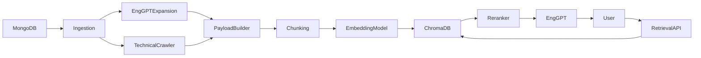
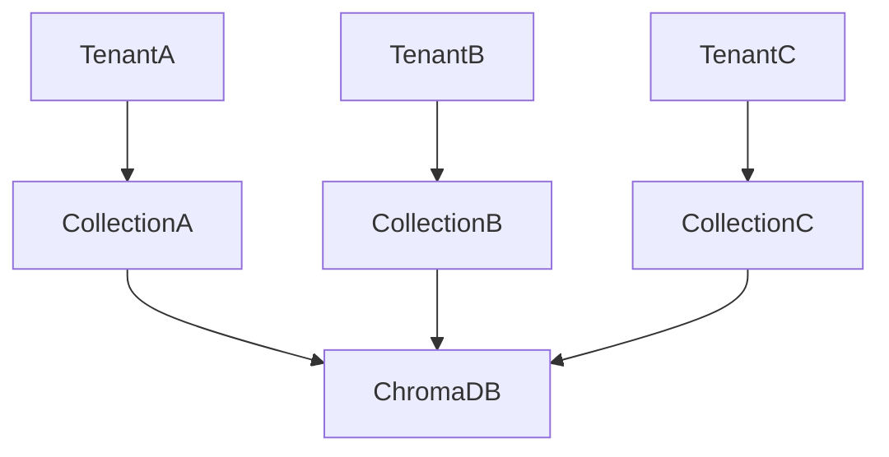

# System Architecture

## Architecture Overview



---

# Components

## MongoDB

Source of truth.

Contains:

* NGSI-LD entities
* DCAT metadata
* SDMX metadata

Dataset entities are identified through:

```json
{
  "_id": {
    "type": "https://uri.etsi.org/ngsi-ld/default-context/Dataset"
  }
}
```

---

## Ingestion Service

Responsibilities:

* detect new datasets
* detect updated datasets
* detect deleted datasets
* build embedding payloads
* generate vectors
* persist vectors

Trigger:

```text
Daily at 03:00
```

---

## Semantic Enrichment

Model:

```text
mixtral
```

Purpose:

Generate:

* concepts
* synonyms
* related terms

Temperature:

```text
0.1
```

Output:

```json
[
  "occupazione",
  "lavoro",
  "mercato del lavoro"
]
```

---

## Technical Crawler

Recursive scan of dataset structure.

Extracts:

* dimension names
* SDMX codes
* labels
* nested descriptions

Output:

```text
FREQ GEO INDICATOR EMP_RATE IT
```

---

## Payload Builder

Final payload structure:

```text
[SEMANTIC BLOCK]
[SEP]
[TECHNICAL BLOCK]
[SEP]
[DESCRIPTION BLOCK]
```

Maximum:

```text
512 tokens
```

---

## Chunking Strategy

Trigger:

```text
payload > 512 tokens
```

Chunking unit:

```text
SDMX dimension
```

Example:

dataset_123_chunk_1
dataset_123_chunk_2
dataset_123_chunk_3

Each chunk keeps the same datasetId.

````

---

## ChromaDB

Storage model:

One collection per tenant.

Example:

```text
rag_tenant_abc123
rag_tenant_company01
rag_tenant_region_lazio
````

Similarity:

```text
Cosine Similarity
```

---

## Retrieval Pipeline

### Step 1

Metadata filtering:

* tenant_id
* theme
* publisher
* geo

### Step 2

Vector search:

```text
n_results = 10
```

### Step 3

Cross-encoder reranking

Model:

```text
ms-marco-MiniLM-L-6-v2
```

### Step 4

Top K selection

```text
3–5 chunks
```

### Step 5

LLM generation

---

## LLM Configuration

Model:

```text
mixtral:q4_k_m
```

Parameters:

```yaml
temperature: 0
top_k: 40
top_p: 0.9
repeat_penalty: 1.1
num_predict: 512
```

---

## Multi-Tenant Architecture



Isolation level:

```text
Physical collection isolation
```

No cross-tenant retrieval is allowed.

---

## Monitoring

Metrics:

* p95 latency
* retrieval count
* rerank duration
* embedding duration
* LLM duration
* no-result rate

Feedback:

* 👍 Positive
* 👎 Negative
